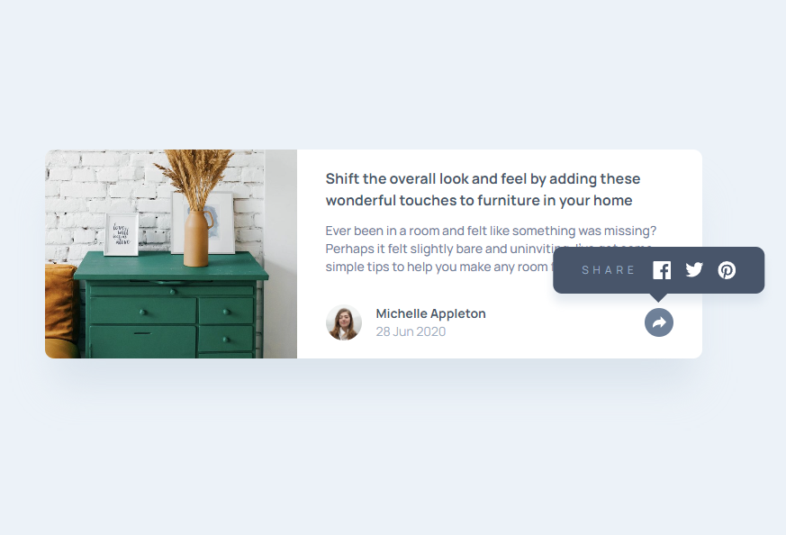
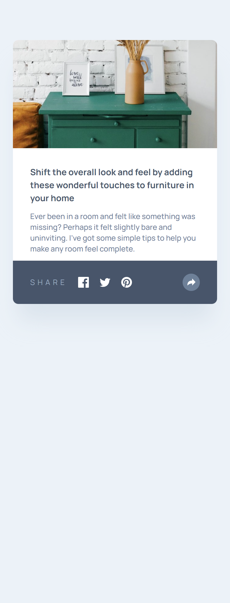

# Article preview component solution

This is a solution to the [Article preview component challenge on Frontend Mentor](https://www.frontendmentor.io/challenges/article-preview-component-dYBN_pYFT). 

## Table of contents

- [Overview](#overview)
  - [The challenge](#the-challenge)
  - [Screenshots](#screenshot)
  - [Links](#links)
- [My process](#my-process)
  - [Built with](#built-with)
  - [What I learned](#what-i-learned)
  - [Continued development](#continued-development)
- [Author](#author)

## Overview

### The challenge

Users should be able to:

- View the optimal layout for the component depending on their device's screen size
- See the social media share links when they click the share icon

### Screenshots

### Links

- Live Site URL: [https://spontaneous-taffy-9c605f.netlify.app/](https://spontaneous-taffy-9c605f.netlify.app/)

## My process

This one was intersting because, I wasn't sure how to approach two visual styles of popover at first. They render div block on mobile but abosolutely positioned bubble on desktop. I started with one for the mobile, and then expanded the component for desktop. It worked, but I have feeling there is probably a better way to do it. It felt like I'm rethinking a whole component again for desktop.

### Built with

- Flexbox
- CSS Grid
- Mobile-first workflow
- [TS](https://www.typescriptlang.org/) - Typescript
- [React](https://reactjs.org/) - JS library
- [Tailwindcss](https://tailwindcss.com/) - CSS library

### What I learned

### Continued development

## Author

- Frontend Mentor - [@raswonders](https://www.frontendmentor.io/profile/raswonders)
- Twitter - [@raswonders](https://www.twitter.com/raswonders)
- LinkedIn - [Rastislav Hepner](https://www.linkedin.com/in/rastislavhepner/)
